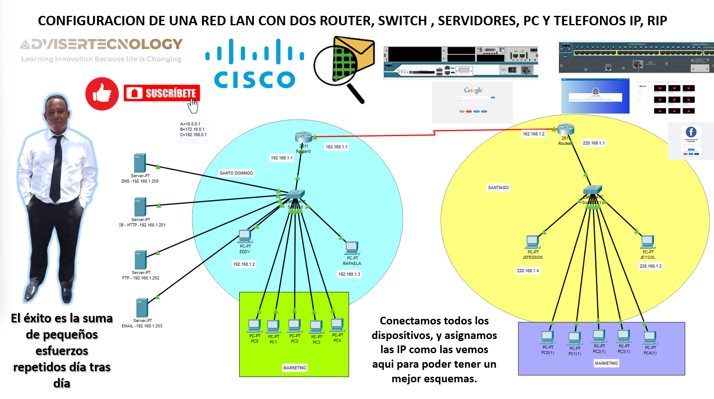
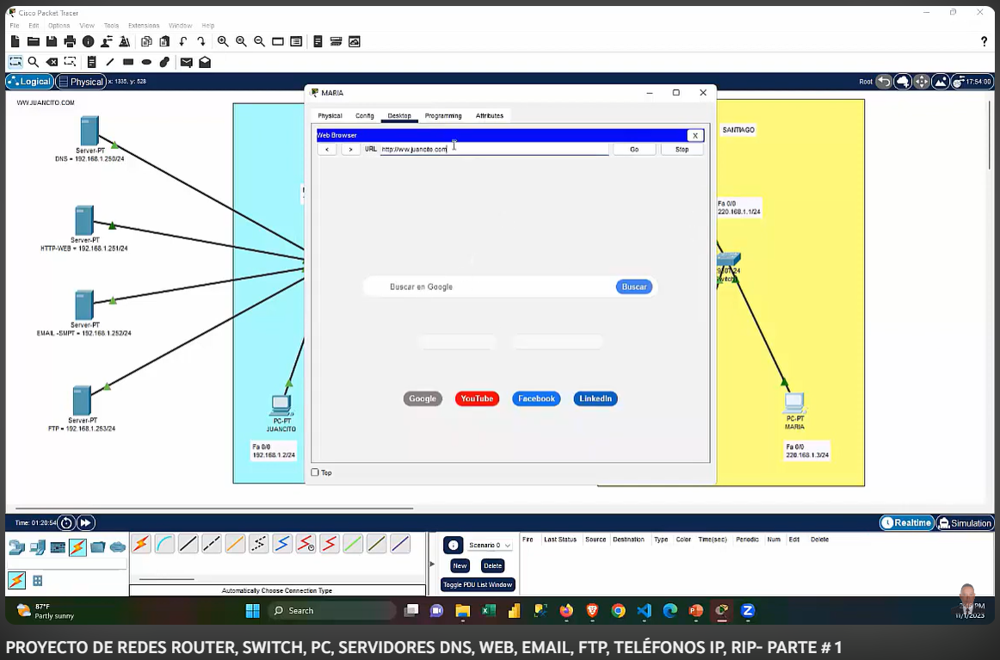

# Manual de Ejercicios Básicos y Fundamentales de Cisco Packet Tracer

Este repositorio alberga un recurso educativo valioso diseñado para aquellos que buscan adquirir una comprensión sólida de los fundamentos de redes y configuraciones prácticas. Nuestro enfoque se centra en la implementación de redes locales (LAN), proporcionando a los usuarios una experiencia práctica en la configuración de redes.

## Características Clave

- **Fundamentos de Redes**: Este manual profundiza en los conceptos esenciales de las redes informáticas, estableciendo una base sólida para comprender la infraestructura de red.

- **Configuración de 2 LAN**: Aprenderás a configurar dos redes locales utilizando dos routers y dos switches, lo que te permitirá explorar escenarios de redes interconectadas.

- **Diversidad de Dispositivos**: Explora la configuración de múltiples PC, teléfonos IP y servidores, incluyendo servidores DNS, HTTP, correo electrónico (EMAIL), FTP y DHCP.

- **Enrutamiento Estático**: Implementa enrutamiento estático para optimizar la conectividad y el flujo de datos dentro de tus redes.

- **Aprendizaje Práctico**: Este proyecto incluye ejercicios prácticos que te ayudarán a aplicar tus conocimientos de manera efectiva.

## Comenzando

Para comenzar, consulta la documentación en el directorio "Documentación" y sigue las instrucciones paso a paso para configurar tus redes. Cada ejercicio está diseñado para proporcionarte una experiencia de aprendizaje práctica y significativa.

## Mira los 2 videos Aqui:

{:target="_blank"}

{:target="_blank"}

## Contribuciones

Si deseas contribuir a este proyecto o realizar mejoras, te invitamos a enviar solicitudes de extracción. Juntos, podemos seguir enriqueciendo este recurso de aprendizaje.

## Licencia

Este proyecto se distribuye bajo la Licencia MIT. Puedes obtener más información en el archivo [LICENSE](LICENSE).

¡Esperamos que este manual sea útil en tu viaje de aprendizaje en el mundo de las redes!

# RedesCisco #ProyectoDeRedes #CiscoPacketTracer 🌐💻📡

¡No olvides suscribirte, compartir, dar like y dejar tus comentarios en la sección de abajo! Tu apoyo es fundamental para mí y me ayuda a seguir creando contenido. 💚

1. 🎬 [Youtube](https://www.youtube.com/@JuancitoPenaV)
2. 👨‍💼 [LinkedIn](https://www.linkedin.com/in/juancitope%C3%B1a/)
3. 📰 [Blog](https://advisertecnology.com/)
4. 📷 [Instagram](https://www.instagram.com/juancito.pena.v/)
5. 📑 [Facebook](https://www.facebook.com/juancito.p.v)
6. 🐦 [Twitter](https://twitter.com/JuancitoPenaV)
